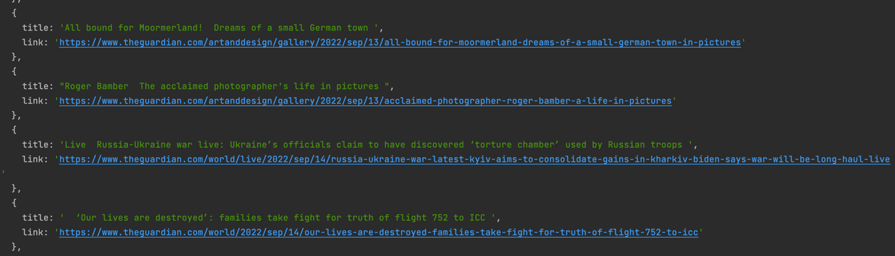

# nodejs-web-scraper
Simple web scraper app where we 
1. scrape h3 titles and their links and put them in an array as follows:
2. Write the data in .csv file

## Run the app
Install Axios and Cheerio 

`npm install`
`npm run dev`

## Preview of the array in console:
